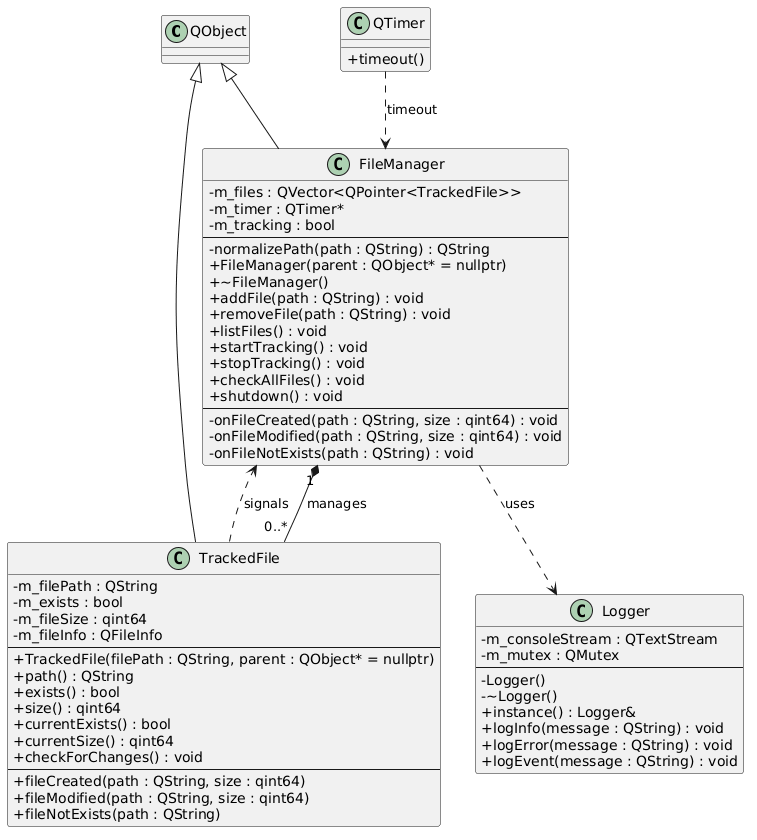
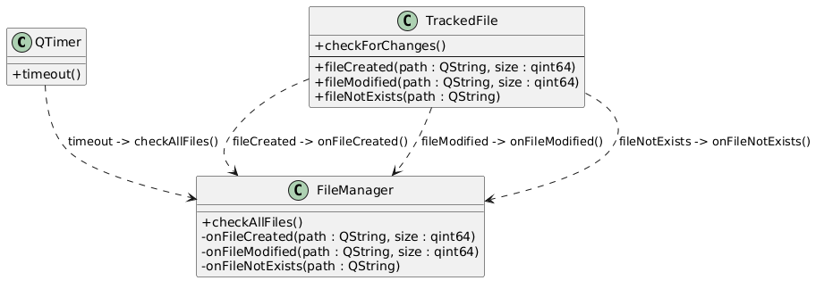

# File-Tracking
# 1. Постановка задачи

Целью работы является разработка консольной утилиты для слежения за состоянием файлов.

Программа должна отслеживать изменения следующих характеристик файлов:
- факт существования файла;
- размер файла.

При изменении состояния файла программа должна выводить соответствующее уведомление в консоль.

Рассматриваются следующие состояния файла:
1. Файл существует и не пуст — выводится информация о размере.
2. Файл существует и изменился — выводится сообщение об изменении и новый размер.
3. Файл не существует — выводится соответствующее уведомление.

Слежение за файлами должно выполняться периодически с заданным интервалом времени (100 мс).
# 2. Предлагаемое решение

## Общая идея решения

Решение основано на объектно-ориентированном подходе с использованием библиотеки Qt.

Основные идеи:
- каждый файл представлен отдельным объектом;
- изменения состояния определяются путем периодического опроса;
- взаимодействие между компонентами реализовано через механизм сигналов и слотов;
- управление системой централизовано через менеджер.

---

## Архитектура 

 
Система состоит из следующих компонентов:

### 1. FileManager
Центральный управляющий класс.

Функции:
- хранение списка файлов;
- добавление и удаление файлов;
- запуск и остановка слежения;
- обработка событий от файлов.

---

### 2. TrackedFile
Класс, представляющий один отслеживаемый файл.

Функции:
- хранение состояния файла (существование, размер);
- проверка изменений;
- генерация событий при изменении состояния.

---

### 3. Logger
Класс для вывода сообщений.

Особенности:
- реализован как Singleton;
- потокобезопасный (использует QMutex);
- поддерживает уровни логирования:
  - INFO
  - ERROR
  - EVENT

---

### 4. main.cpp
Точка входа программы.

Функции:
- обработка пользовательского ввода;
- парсинг команд;
- вызов методов FileManager.

---

