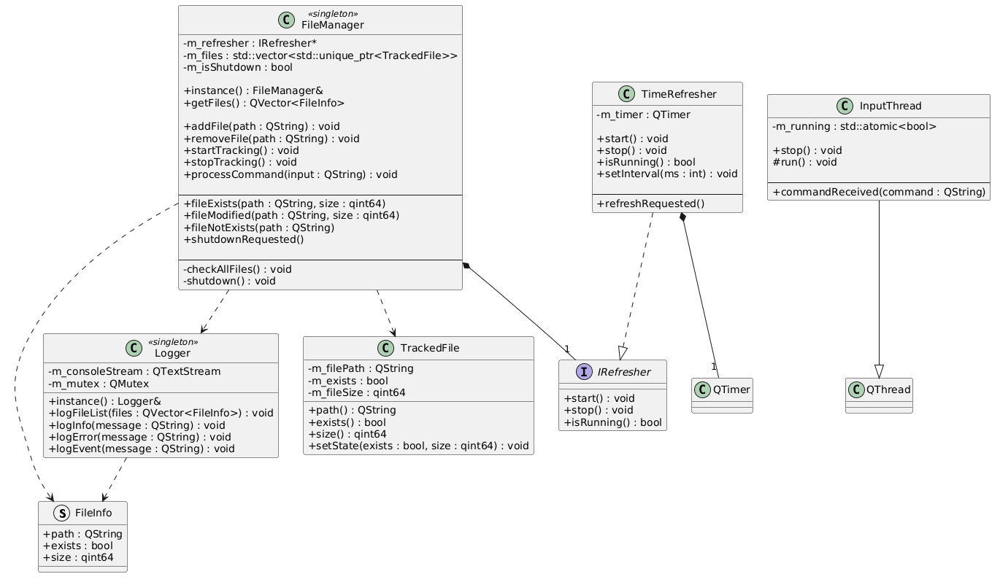
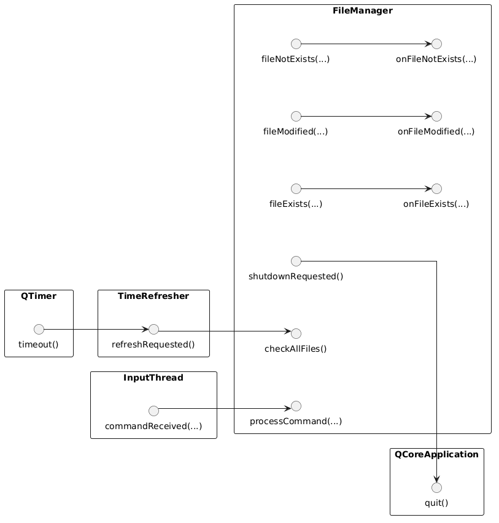

# File-Tracking
# 1. Постановка задачи

Целью работы является разработка консольной утилиты для слежения за состоянием файлов.

Программа должна отслеживать изменения следующих характеристик файлов:
- факт существования файла;
- размер файла.

При изменении состояния файла программа должна выводить соответствующее уведомление в консоль.

Рассматриваются следующие состояния файла:
1. Файл существует и не пуст - выводится информация о размере.
2. Файл существует и изменился - выводится сообщение об изменении и новый размер.
3. Файл не существует - выводится соответствующее уведомление.

Слежение за файлами должно выполняться периодически с заданным интервалом времени (100 мс).
# 2. Предлагаемое решение

## Общая идея решения

Основные идеи:
- каждый файл представлен отдельным объектом;
- изменения состояния определяются путем периодического опроса;
- взаимодействие между компонентами реализовано через механизм сигналов и слотов Qt;
- пользовательский ввод выполняется в отдельном потоке;
- управление системой централизовано через менеджер;

---

## 3. Архитектура 

 
Система состоит из следующих компонентов:

## 3.1 FileManager

Центральный управляющий класс системы.

Функции:
- хранение списка отслеживаемых файлов;
- добавление и удаление файлов;
- запуск и остановка слежения;
- обработка команд пользователя;
- обработка событий изменения файлов.

Особенности:
- реализован как Singleton;
- использует интерфейс `IRefresher`;
- управляет жизненным циклом объектов файлов.

---

## 3.2 TrackedFile

Класс, представляющий один отслеживаемый файл.

Функции:
- хранение состояния файла;
- хранение пути к файлу;
- хранение информации о существовании файла;
- хранение размера файла;
- обновление состояния файла.

---

## 3.3 Logger

Класс для вывода сообщений в консоль.

Особенности:
- реализован как Singleton;
- использует `QMutex`;
- поддерживает уровни логирования:
  - INFO
  - ERROR
  - EVENT

---

## 3.4 InputThread

Класс для асинхронного чтения пользовательского ввода.

Функции:
- чтение команд из консоли в отдельном потоке;
- передача команд через сигналы Qt;
- предотвращение блокировки основного event loop.

---

## 3.5 IRefresher

Абстрактный интерфейс механизма обновления состояния файлов.

Функции:
- запуск обновления;
- остановка обновления;
- проверка состояния обновления.

Интерфейс позволяет заменить механизм обновления без изменения `FileManager`.

---

## 3.6 TimeRefresher

Реализация интерфейса `IRefresher` на основе `QTimer`.

Функции:
- генерация периодических сигналов обновления;
- настройка интервала обновления;

---

# 4. Поддерживаемые команды

| Команда | Описание |
|---|---|
| `add <path>` | добавить файл в список отслеживания |
| `remove <path>` | удалить файл из списка отслеживания |
| `list` | показать список отслеживаемых файлов |
| `start` | начать слежение |
| `stop` | остановить слежение |
| `exit` | завершить программу |

---

# 5. Особенности и ограничения реализации

- пути нормализуются перед обработкой;
- директории не могут быть добавлены в список отслеживания;
- пути с пробелами не поддерживаются;
- изменение файла определяется по изменению размера;
- изменение содержимого без изменения размера не считается изменением;
- при удалении всех файлов из списка слежение автоматически останавливается;

# 6 Тест-кейсы

### Тест 1. list при пустом списке
**Шаги:**
1. Ввести команду `list`

**Вывод программы:**  
INFO: No files being tracked

### Тест 2. start без файлов
**Шаги:**
1. Ввести команду `start`

**Вывод программы:**  
ERROR: No files to track. Add files first.

### Тест 3. stop, когда слежение не запущено
**Шаги:**  
1. Ввести команду `stop`

**Вывод программы:**  
ERROR: Tracking is not running

### Тест 4. неизвестная команда
**Шаги:**
1. Ввести команду `abc`

**Вывод программы:**  
ERROR: Unknown command: abc

### Тест 5. лишние аргументы
**Шаги:**
1. Ввести команду `list test.txt`

**Вывод программы:**  
ERROR: Too many arguments for command: list

### Тест 6. неверное число аргументов
**Шаги:**
1. Ввести команду `add`

**Вывод программы:**  
ERROR: Invalid number of arguments for command: add
INFO: Usage: add/remove <path>

### Тест 7. несколько аргументов
**Шаги:**
1. Ввести команду `add file1 file2`

**Вывод программы:**  
ERROR: Invalid number of arguments for command: add
INFO: Usage: add/remove <path>

### Тест 8. exit
**Шаги:**
1. Ввести команду `add test.txt`
2. Ввести команду `start`
3. Ввести команду `exit`

**Вывод программы:**  
EVENT: File added: test.txt  
EVENT: File exists: test.txt, size: N bytes  
INFO: Tracking started for 1 files  
INFO: Tracking stopped  

### Тест 9. добавление существующего файла
**Шаги:**
1. Ввести команду `add test.txt`

**Вывод программы:**  
EVENT: File added: test.txt  
EVENT: File exists: test.txt, size: N bytes  

### Тест 10. list после добавления
**Шаги:**
1. Ввести команду `add test.txt`
2. Ввести команду `list`

**Вывод программы:**  
INFO: Tracked files (1):  
INFO:   test.txt (exists, size: N bytes)

### Тест 11. запуск слежения
**Шаги:**
1. Ввести команду `add test.txt`
2. Ввести команду `start`

**Вывод программы:**  
EVENT: File added: test.txt  
EVENT: File exists: test.txt, size: N bytes 
INFO: Tracking started for 1 files

### Тест 12. изменение файла
**Шаги:**
1. Ввести команду `add test.txt`
2. Ввести команду `start`
3. Изменить файл `test.txt`

**Вывод программы:**  
EVENT: File modified: test.txt, size: N bytes

### Тест 13. удаление файла
**Шаги:**
1. Ввести команду `add test.txt`
2. Ввести команду `start`
3. Удалить файл `test.txt`

**Вывод программы:**  
EVENT: File does not exist: test.txt

### Тест 14. восстановление файла
**Шаги:**
1. Ввести команду `add test.txt`
2. Ввести команду `start`
3. Удалить файл `test.txt`
4. Создать файл `test.txt` заново

**Вывод программы:**  
EVENT: File does not exist: test.txt  
EVENT: File exists: test.txt, size: N bytes  

### Тест 15. остановка
**Шаги:**
1. Ввести команду `add test.txt`
2. Ввести команду `start`
3. Ввести команду `stop`

**Вывод программы:**  
INFO: Tracking started for 1 files  
INFO: Tracking stopped  

### Тест 16. изменение одного файла
**Шаги:**
1. Ввести команду `add test1.txt`
2. Ввести команду `add test2.txt`
3. Ввести команду `start`
4. Изменить файл `test1.txt`

**Вывод программы:**  
EVENT: File modified: test1.txt, size: N bytes   

### Тест 17. удаление одного файла
**Шаги:**
1. Ввести команду `add test1.txt`
2. Ввести команду `add test2.txt`
3. Ввести команду `start`
4. Удалить файл `test2.txt`

**Вывод программы:**  
EVENT: File does not exist: test2.txt  

### Тест 18. list с несколькими файлами
**Шаги:**
1. Ввести команду `add test1.txt`
2. Ввести команду `add test2.txt`
3. Ввести команду `list`

**Вывод программы:**  
INFO: Tracked files (2):  
INFO:   test1.txt (exists, size: N bytes)  
INFO:   test2.txt (exists, size: N bytes)  

### Тест 19. повторное добавление
**Шаги:**
1. Ввести команду `add test.txt`
2. Ввести команду `add test.txt`

**Вывод программы:**  
INFO: File already tracked: test.txt  

### Тест 20. удаление несуществующего
**Шаги:**
1. Ввести команду `remove test.txt`

**Вывод программы:**  
ERROR: File not found in the list: test.txt  

### Тест 21. путь к папке
**Шаги:**
1. Ввести команду `add test_folder`

**Вывод программы:**  
ERROR: The path is not a file: test_folder  

### Тест 22. пустой путь
**Шаги:**
1. Ввести команду `add "" `

**Вывод программы:**  
ERROR: Empty path  

### Тест 23. путь с пробелами
**Шаги:**
1. Ввести команду `add C:/My Folder.txt`

**Вывод программы:**  
ERROR: Invalid number of arguments for command: add  

### Тест 24. несуществующий файл
**Шаги:**
1. Ввести команду `add nofile.txt`

**Вывод программы:**  
EVENT: File added: nofile.txt   
EVENT: File does not exist: nofile.txt   

### Тест 25. повторный start
**Шаги:**
1. Ввести команду `add test.txt`
2. Ввести команду `start`
3. Ввести команду `start`

**Вывод программы:**  
EVENT: File added: test.txt  
EVENT: File exists: test.txt, size: N bytes  
INFO: Tracking started for 1 files   
ERROR: Tracking already running   

### Тест 26. повторный stop
**Шаги:**
1. Ввести команду `add test.txt`
2. Ввести команду `start`
3. Ввести команду `stop`
4. Ввести команду `stop`

**Вывод программы:**  
EVENT: File added: test.txt  
EVENT: File exists: test.txt, size: N bytes  
INFO: Tracking started for 1 files   
INFO: Tracking stopped    
ERROR: Tracking is not running    

### Тест 27. файл становится пустым
**Шаги:**
1. Ввести команду `add test.txt`
2. Ввести команду `start`
3. Очистить содержимое файла

**Вывод программы:**  
EVENT: File added: test.txt   
EVENT: File exists: test.txt, size: N bytes   
INFO: Tracking started for 1 files   
EVENT: File modified: test.txt, size: 0 bytes  

### Тест 28. быстро удалить и создать
**Шаги:**
1. Ввести команду `add test.txt`
2. Ввести команду `start`
3. Удалить файл
4. Сразу создать файл заново

**Вывод программы:**  
EVENT: File does not exist: test.txt   
EVENT: File exists: test.txt, size: N bytes    

### Тест 29. изменение без изменения размера
**Шаги:**
1. Ввести команду `add test.txt`  
2. Ввести команду `start`
3. Изменить содержимое файла без изменения размера

**Вывод программы:**  
(сообщения отсутствуют)  

### Тест 30. remove одного из нескольких во время слежения
**Шаги:**
1. Ввести команду `add test1.txt`
2. Ввести команду `add test2.txt`
3. Ввести команду `start`
4. Ввести команду `remove test1.txt`

**Вывод программы:**  
INFO: File removed: test1.txt  

### Тест 31. переименование файла
**Шаги:**
1. Ввести команду `add test1.txt`
2. Ввести команду `start`
3. Переименовать файл `test1.txt` в `test10.txt`
4. Переименовать файл `test10.txt` в `test1.txt`

**Вывод программы:**  
EVENT: File does not exist: test1.txt  
EVENT: File exists: test1.txt, size: N bytes  

### Тест 32. автоостановка при удалении всех файлов из списка отслеживаемых

**Шаги:**
1. Ввести команду `add test.txt`
2. Ввести команду `start`
3. Ввести команду `remove test.txt`

**Вывод программы:**  
INFO: File removed: test.txt   
INFO: Tracking stopped  
